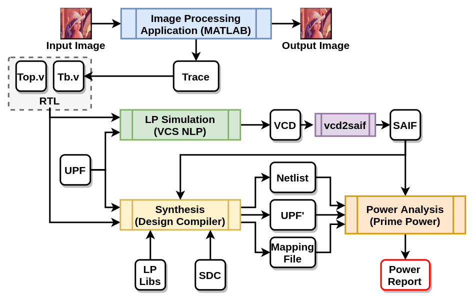

# Ax-LEAP: Enabling Low-Power Approximations Through Unified Power Format

## Abstract
> Approximate Computing aims at achieving better performance at a marginal loss of accuracy in error-resilient applications. Several approximate arithmetic circuits have been proposed in the past to achieve better performance using carry prediction schemes, block-based approaches and genetic algorithms. However, these architectures are usually non power-aware and often incur large area overhead with the introduction of re-configurability. In this work, we explore a new facet of approximation, which involves using the Unified Power Format (UPF) model to introduce approximation on additions. We call this methodology *Ax-LEAP*. Further, we validate the proposed methodology on a new approximate adder, which we term as *AxL-Add*. The *AxL-Add* has a simple and re-configurable design with a marginal area overhead of 1.69% over accurate adder. After extensive evaluation, we show that our methodology is up to 67% better in terms of power consumption while providing near accurate results at the end application.

## Terminology
1. **AxLEAP**: 
2. **AxL-Add**:
3. **Trace**:
4. **VCD dump**:
5. **Error Report**:
6. **Power Report**:


## About this repository
Following is the workflow that we follow fot the *AxLEAP*.


This repository contains provides the following:
1. MATLAB code for generating error matrix for *AxL-Add*.
2. Verilog code for hardware synthesis of *AxL-Add*.
3. Scripts to verify MATLAB code with Verilog Implementation.
4. Scripts to generate end-application traces.
5. Scripts to generate VCD trace from end-application traces.

Everyting in this repository is controlled with makefiles.
Run `make help` to print out all the functionalities provided by any of the makefile provided in this repository.

## Prerequisites
1. Any *Debian* based Linux distribution (preferably Ubuntu 20.04 LTS).
2. MATLAB (preferably R2018b).
3. icarus verilog (preferably )


## Getting Started
### Clone the repo
```bash
$ git clone <repository-url>

```
### Generating Error Merices for *AxL-Add*
```bash
$ cd matlab
$ make clean        # clean any existing reports
$ make geterror     # generate error report
```
Error Report will be saved in `matlab/Readme.md` for all configurations.


### Verifying Verilog Implementation with MATLAB code
```bash
$ cd matlab
$ make getdumps     # generate dumpfiles using MAATLAB
$ cd ../verilog
$ make verify       # Verify verilog implementation with MATLAB code
```


### Generating Application Traces
To be added by @kaustav


### Generating Applicatioon VCD
```bash
$ cd verilog
$ ./generate_all_vcd.sh
```

This will generate VCD files in `vcd` folder of respective designs.