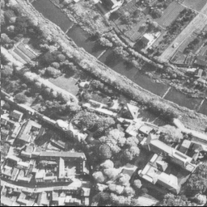
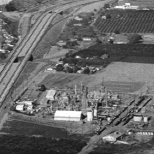
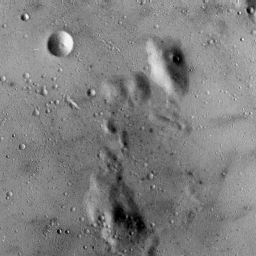

# Tables & Figures

## T1: Area, Power, Delay, and PDP Tables

| 32,8     | Area   | Power | Delay | PDP     |
|----------|--------|-------|-------|---------|
| AxL-Add  |    940 | 41.25 |   1.8 |   74.25 |
| BCSA     | 941.58 | 37.67 |   1.4 |  52.738 |
| RAPCLA   |   1007 | 40.78 |  1.33 | 54.2374 |
| Accurate |    931 | 39.04 |  1.53 | 59.7312 |
| ACA-CSU  |  974.3 | 39.52 |  1.48 | 58.4896 |

| 32,4     | Area   | Power | Delay |     PDP |
|----------|--------|-------|-------|--------:|
| AxL-Add  | 951.03 |  42.3 |  1.93 |  81.639 |
| BCSA     | 850.08 | 33.35 |  1.28 |  42.688 |
| RAPCLA   | 759.16 | 31.81 |  1.11 | 35.3091 |
| Accurate |    931 | 39.04 |  1.53 | 59.7312 |
| ACA-CSU  |  873.2 |  35.3 |  1.26 |  44.478 |

| 16,4     | Area   | Power | Delay |     PDP |
|----------|--------|-------|-------|--------:|
| AxL-Add  |  448.3 | 18.84 |  1.47 | 27.6948 |
| BCSA     | 453.27 | 18.01 |  1.17 | 21.0717 |
| RAPCLA   | 425.14 | 17.05 |  1.05 | 17.9025 |
| Accurate | 437.07 | 17.87 |  1.23 | 21.9801 |
| ACA-CSU  |  462.2 | 19.03 |  1.09 | 20.7427 |

| 16,2     | Area   | Power | Delay |     PDP |
|----------|--------|-------|-------|--------:|
| AxL-Add  |  443.2 |  18.5 |  1.67 |  30.895 |
| BCSA     | 255.36 |  19.5 |  0.98 |   19.11 |
| RAPCLA   | 318.05 | 12.95 |  0.82 |  10.619 |
| Accurate | 437.07 | 17.87 |  1.23 | 21.9801 |
| ACA-CSU  |    257 |  9.62 |  0.99 |  9.5238 |

| 8,2      | Area   | Power | Delay |     PDP |
|----------|--------|-------|-------|--------:|
| AxL-Add  |  213.5 | 11.43 |  1.26 | 14.4018 |
| BCSA     | 186.84 |  8.72 |  0.95 |   8.284 |
| RAPCLA   | 175.64 |  7.95 |  0.91 |  7.2345 |
| Accurate | 210.62 | 10.46 |  1.04 | 10.8784 |
| ACA-CSU  |    184 |  8.23 |   0.9 |   7.407 |

**Units**
1. Area: μm2
2. Power: nW
3. Delay: ns
4. PDP: nW * ns

## T2: Block-wise Power, Delay and PDP for AxL-Add

**32,8**

| Adders | Power | Delay | PDP     |
|--------|-------|-------|--------:|
|  00    | 21.19 |  0.93 | 19.7067 |
|  10    | 31.79 |  1.35 | 42.9165 |

**32,4**

| Adders | Power | Delay | PDP     |
|--------|-------|-------|--------:|
|  0000  | 23.57 |  0.93 | 21.9201 |
|  1000  | 28.21 |  1.18 | 33.2878 |
|  1100  | 32.99 |  1.41 | 46.5159 |
|  1110  | 37.79 |  1.62 | 61.2198 |

**16,4**

| Adders | Power | Delay | PDP     |
|--------|-------|-------|--------:|
|  00    |  9.63 |  0.73 |  7.0299 |
|  10    | 14.77 |  1.08 | 15.9516 |

**16,2**

| Adders | Power | Delay | PDP     |
|--------|-------|-------|--------:|
|  0000  | 10.83 |  0.81 |  8.7723 |
|  1000  | 13.03 |  1.03 | 13.4209 |
|  1100  | 14.86 |  1.25 |  18.575 |
|  1110  |  16.7 |  1.43 |  23.881 |

**8,2**

| Adders | Power | Delay | PDP    |
|--------|-------|-------|-------:|
|  00    |  7.07 |  0.61 | 4.3127 |
|  10    |  9.41 |  0.89 | 8.3749 |

**Units**
1. Power: nW
2. Delay: ns
3. PDP: nW * ns

## T3: Area, No of ISO cells used

| Config  | Area   | no of ISO cells |
|---------|--------|----------------:|
| 32,8    |    940 |              18 |
| 32,4    | 951.03 |              20 |
| 32,2    | 961.13 |              24 |
| 32,1    | 981.39 |              32 |
| 16,4    |  438.3 |              10 |
| 16,2    |  443.2 |              12 |
| 16,1    | 453.34 |              16 |
| 8,2     |  213.5 |               6 |
| 8,1     | 219.02 |               8 |

**Units**
1. Area: μm2

## T4: End-application Power

| Design        | Lena  | Moon  | Aerial | Chemical | Average |
|---------------|-------|-------|--------|----------|---------|
| AxL-Add 0000  | 1.644 | 1.721 |  1.752 |    1.676 | 1.69825 |
| AxL-Add 1000  | 2.483 | 2.565 |  2.594 |    2.518 |    2.54 |
| AxL-Add 1100  | 3.243 | 3.331 |  3.368 |    3.281 | 3.30575 |
| AxL-Add 1110  | 4.522 | 4.624 |  4.665 |    4.567 |  4.5945 |
| RAPCLA        | 5.132 | 5.267 |  5.156 |    5.185 |   5.185 |
| BCSA          | 5.434 | 5.584 |  5.463 |    5.501 |  5.4955 |
| ACA-CSU       | 4.874 | 4.963 |  4.891 |    4.876 |   4.901 |

**Units**
1. Power: nW

## Images Used in Paper

  
   
  
  

